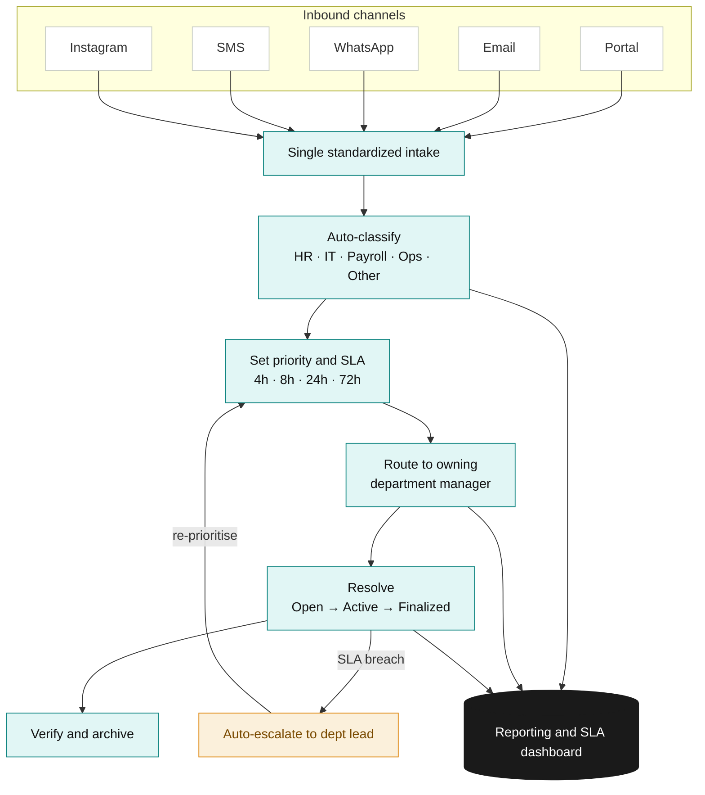

# RequestFlow — Employee Request Management System

A working system I designed for **Physique 57** to fix a simple but costly problem: internal employee requests were scattered across email, WhatsApp, SMS and DMs, so they got lost, had no clear owner, and couldn't be reported on. RequestFlow brings them into one place and automates the busywork around them.

**▶ Try it live:** https://drashtichovatiya63-dev.github.io/erms-prototype/

*Opens in any browser, no login needed. It loads with sample data so you can explore it right away.*

## The workflow at a glance

---

## The problem I set out to solve

When requests come in through five different channels, four things go wrong:

- **Nothing is visible** — requests sit in inboxes and chats with no single view of what's open.
- **Nobody clearly owns them** — no assigned team, no deadline.
- **Everything is slow** — someone has to manually read each message and figure out where it goes.
- **You can't measure anything** — the data is too scattered to report on.

The common thread is that the sorting and tracking is all manual. So I designed a system that automates it.

## How the system works

Think of it as one intake funnel with automation built into every step:

1. **One way in.** Every request — whatever channel it started on — enters through a single standardized form.
2. **It sorts itself.** The moment a request lands, the system reads it and automatically decides the department (HR, IT, Payroll, Operations), the priority, and the deadline — and it shows *why* it decided, so a person can always trust or override it.
3. **It routes to the right owner.** The request lands in the correct department's queue automatically. No manual forwarding.
4. **It tracks itself to done.** Every request gets a unique ID and moves through **Open → Active → Finalized**, with a full history of what happened and when.
5. **It won't let things slip.** Each request has a service-level deadline (SLA). If one runs late, the system automatically flags and escalates it.
6. **It reports in real time.** A live dashboard shows volumes, workload, SLA performance and where things are getting stuck — the visibility that scattered chats never gave.

## Built around real roles

I designed the system so each person only sees what's relevant to them. Use the **"View as"** switcher (top-right) to try each one:

- **Employee** — raises requests and sees only their own.
- **Department Manager** (HR / IT / Payroll / Operations) — sees only their department's queue and reporting.
- **CEO** — a company-wide, read-only overview.
- **Admin** — runs the system, and manages the employee directory (adding people, auto-generating employee IDs, and setting who owns each department).

*For this demo the roles are a simple switcher so you can see each view instantly. In a real rollout this becomes proper login and access control — for example through Salesforce, which is already part of Physique 57's stack.*

## Why I built it this way

I kept the build deliberately lightweight so it just works the moment you open the link — no setup, nothing to break. The point of this stage isn't a finished product; it's to prove the **logic and the workflow** are right. Everything is designed to be swapped onto Physique 57's real tools when it goes live.

## Designed to scale

The prototype proves the thinking. Taking it live is mostly connecting it to the real tools:

- **One shared source of truth** — move the data into Salesforce so everyone works from the same live information.
- **Real access control** — proper logins replacing the demo role switcher.
- **The channels feed in automatically** — email, WhatsApp, SMS and Instagram connect through integrations (Intercom, Twilio and the relevant APIs), so employees keep messaging the way they already do while every request still becomes a tracked ticket.
- **Smarter sorting over time** — the automatic categorisation can be upgraded from keyword rules to AI, with no change to the rest of the workflow.

At Physique 57's size (a few hundred people across studios and HQ), this runs comfortably with plenty of room to grow as the brand expands.

---

*Built as part of the Automation Analyst assessment for Physique 57 — focused on the systems design and automation logic, not a production-ready product.*
